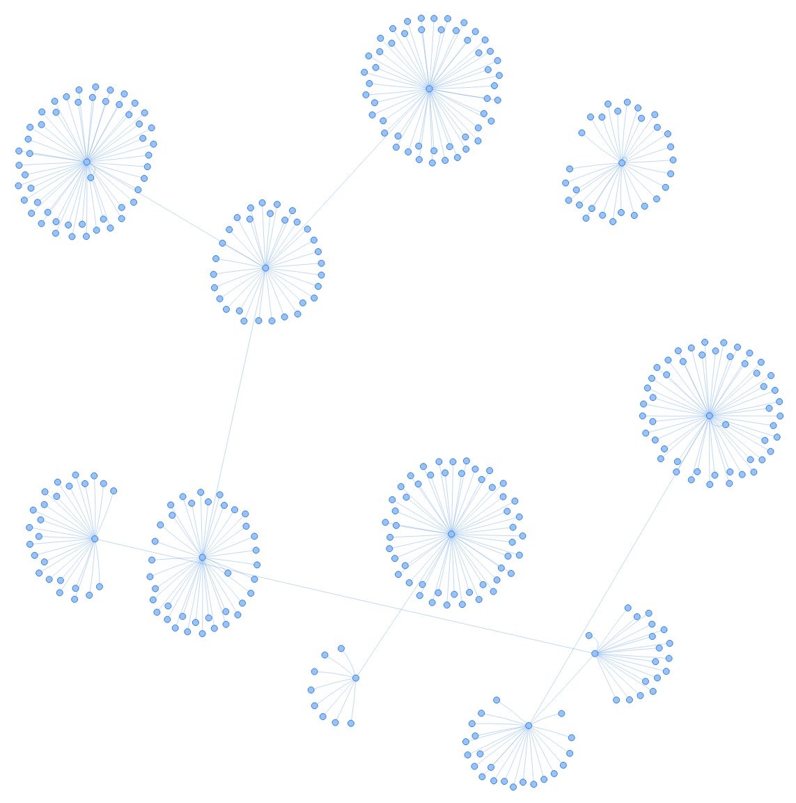
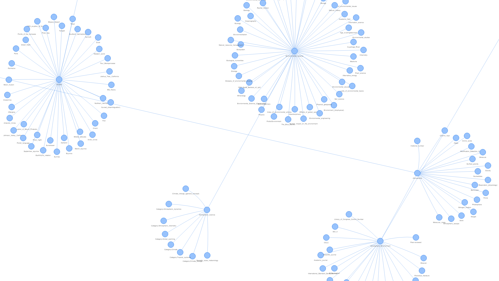
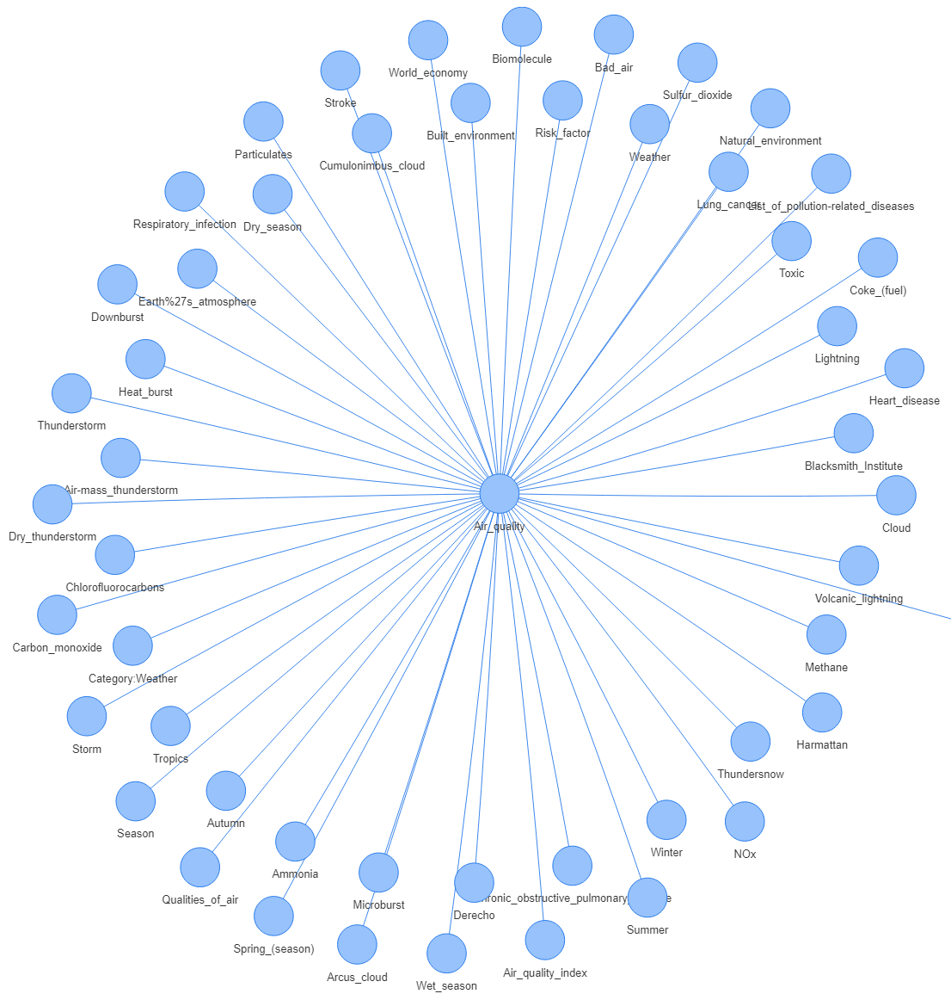

# topic-crawler
Automated topic discovery crawler

## How It Works
1. Given a starting topic, the crawler downloads the Wikipedia article for that topic.
2. The HTML is parsed and all internal links are identified with BeautifulSoup4.
3. Each link to another Wikipedia article is then explored, returning to step 1.
4. This continues until the max crawl distance is reached to prevent it from infinitely exploring associations.

This process creates a tree structure, where the starting topic is the top node. Related topics (identified through page links) become nodes on the tree. Topics related to those nodes become more nodes.

The height of the tree is limited by a setting called *max crawl distance*, while the number of branches per node is limited by another setting called *crawl limit per node*.

## End Result
After the crawling process is complete, the topic associations are merged into a data file that can be visualized in any tool capable of creating a network chart. For the examples below, I used Qlik Sense.

